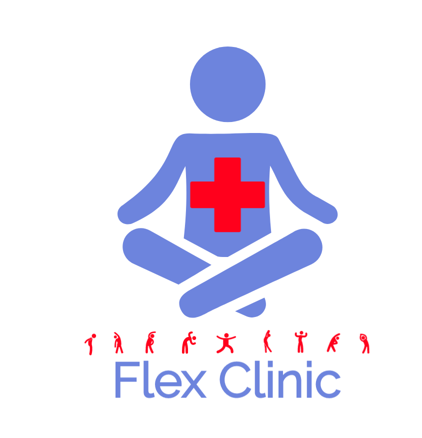

# FlexClinic 


## About This Project
Quadoodle is a hackathon project that we four created. Its a fun easy 
way to play some funny games online with your friends or strangers!
Draw a quadrant of a drawing and align with others to create a 
hilarious image!

## Authors
 - [Vishal Desh](https://github.com/VDeshh)
 - [Noah Caleneau](https://github.com/caleanunoah)
 - [Arash Rizvi](https://github.com/rizvi95/)
 - [HarditSingh](https://github.com/HSHarditSingh)
 - [Suraj Puvvadi](https://github.com/)


## License

```
Copyright (C) 2020 Vishal Desh, Noah Caleanu, HarditSingh, Suraj Puvvadi, Arash Rizvi

This program is free software: you can redistribute it and/or modify
it under the terms of the GNU General Public License as published by
the Free Software Foundation, either version 3 of the License, or
(at your option) any later version.

This program is distributed in the hope that it will be useful,
but WITHOUT ANY WARRANTY; without even the implied warranty of
MERCHANTABILITY or FITNESS FOR A PARTICULAR PURPOSE.  See the
GNU General Public License for more details.

You should have received a copy of the GNU General Public License
along with this program.  If not, see <http://www.gnu.org/licenses/>.
```

## Available Scripts

In the project directory, you can run:

## Learn More

You can learn more in the [Android Studio documentation](https://developer.android.com/distribute/best-practices/develop/index.html?gclid=Cj0KCQjwirz3BRD_ARIsAImf7LOB1IG9HhEE2wNpg-I6oHEKPGXEDOC9_SKUltyw4SR4qsYjci9j3wMaAtU7EALw_wcB).

To learn Java, check out the [Java documentation](https://docs.oracle.com/en/java/).
